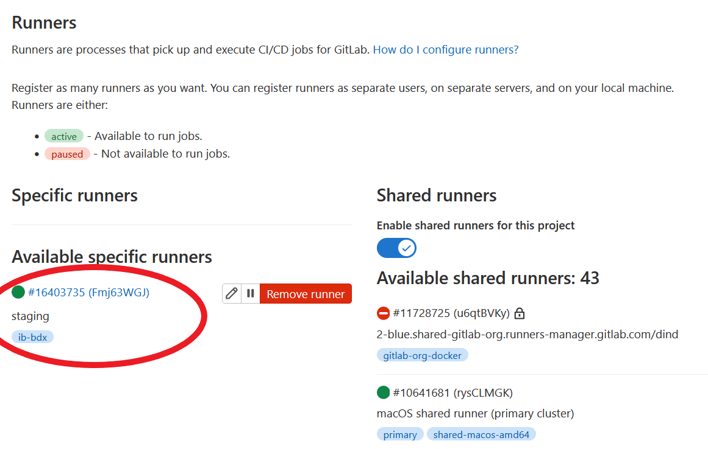

# Installation d'un runner gitlab

## Téléchargement et installation du binaire

```sh
# Download the binary for your system
sudo curl -L --output /usr/local/bin/gitlab-runner https://gitlab-runner-downloads.s3.amazonaws.com/latest/binaries/gitlab-runner-linux-amd64

# Give it permission to execute
sudo chmod +x /usr/local/bin/gitlab-runner

# Create a GitLab Runner user
sudo useradd --comment 'GitLab Runner' --create-home gitlab-runner --shell /bin/bash

# Install and run as a service
sudo gitlab-runner install --user=gitlab-runner --working-directory=/home/gitlab-runner
sudo gitlab-runner start
```


## Configuration de l'URI et port d'écoute (via ngrok)

La valeur `Forwarding` de ngrok est récupérée puis ajoutée à la configuration de GitLab Runner.

```sh
cat << EOF > ~/.gitlab-runner/config.toml
[session_server]
  listen_address = [ngrok_uri]:[ngrok_port]
EOF
```

## Enregistrement du runner

Il faut spécifier notre token gitlab pour lier le runner local à gitlab.

```sh
GITLAB_RUNNER_TOKEN=GR1348941zgLYXgM32gTfBuyWAgvY

sudo gitlab-runner register \
    --url https://gitlab.com/ \
    --registration-token "$GITLAB_RUNNER_TOKEN" \
    --tag-list "docker,staging,ib-bdx" \
    --name "staging" \
    --executor "docker" \
    --docker-host 127.0.0.1:2375 \
    --docker-privileged=true \
    --docker-image "docker:latest"

sudo gitlab-runner register -n \
    --url https://gitlab.com/ \
    --registration-token "$GITLAB_RUNNER_TOKEN" \
    --tag-list "shell,staging,ib-bdx" \
    --name "staging" \
    --executor "shell" \
    --shell "bash"
```

Modification du nombre de concurrents

```sh
sed -i 's/concurrent = 1/concurrent = 5/g' /etc/gitlab-runner/config.toml
```

Le contenu final du fichier de configuration

```sh
sudo cat /etc/gitlab-runner/config.toml
concurrent = 3
check_interval = 0

[session_server]
  listen_address = "7.tcp.eu.ngrok.io:10604"
  session_timeout = 1800

[[runners]]
  name = "staging"
  url = "https://gitlab.com/"
  token = "Fmj63WGJM8zyy5iS5Gky"
  executor = "docker"
  [runners.custom_build_dir]
  [runners.cache]
    [runners.cache.s3]
    [runners.cache.gcs]
    [runners.cache.azure]
  [runners.docker]
    host = "unix:///var/run/docker.sock"
    tls_verify = false
    image = "docker:latest"
    privileged = true
    disable_entrypoint_overwrite = false
    oom_kill_disable = false
    disable_cache = false
    volumes = ["/var/run/docker.sock:/var/run/docker.sock", "/cache"]
    shm_size = 0

[[runners]]
  name = "staging"
  url = "https://gitlab.com/"
  token = "UPuRmgHsLztg-7wfgE_g"
  executor = "shell"
  shell = "bash"
  [runners.custom_build_dir]
  [runners.cache]
    [runners.cache.s3]
    [runners.cache.gcs]
    [runners.cache.azure]
```


## Verification dans Gitlab.com que le runner est bien déclaré et opérationnel



Le runner est bien fonctionnel.

## Utilisation

Pour utiliser notre runner lors de l'exécution du pipeline, il faut spécifier des tags dans les tâches.

```yml
job:
  tags:
    - docker
    - staging
    - ib-bdx
```

[Doc](https://docs.gitlab.com/ee/ci/yaml/index.html#tags)

## Résolution de problème

Dans le cas-où le runner ne serait pas à l'état up dans gitlab et aurait le message "not contacted the instance", il faut exécuter la commande :

```sh
sudo gitlab-runner verify
```
